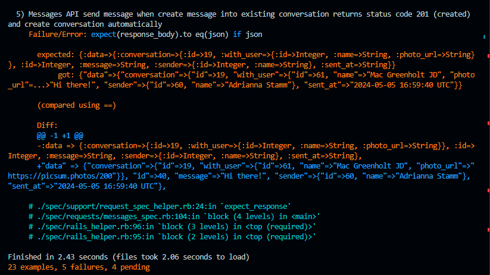

# README

The challenge is make sure when you run `bundle exec rspec`, all result is green (without error):) 

## Version
* Rails v6.1.7
* Ruby v3.3.0
* Database postgreSQL
* Bundle v2.5.9

Test Case Result 

Saya sudah mencoba untuk memperbaiki beberapa hal sampai dengan saya menemukan beberapa hal yang menjad pertimbangngan buat saya, yaitu :
1. Menurut saya sendiri setelah mencari-cari, `request_spec_helper.rb` memiliki bug dimana saya sering ketemu errornnya adalah 

Saya mencari solusinya dan bertanya-tanya ke beberapa teman saya, ada kemungkinan bahwa bug dan tentu saja saya juga bisa salah (karena response yang saya dapat menurut saya sudah sama dengan expected responsenya)

2. Maka dari itu, saya akan memperlihatkan Test Case Result saya (walaupun masih ada beberapa error, tapi saya sudah cukup senang dengan resposenya sesuai dengan struktur expected responsenya). Bisa dilihat [disini](https://gist.github.com/Junatius/3ceb2b39f4d9eaedeaee421376587768)

3. dalam bentuk screenshot, ini hasil test case saya
Number 1 Failure

Number 2 Failure

Number 3 Failure

Number 4 Failure

Number 5 Failure

Saya merasa cukup senang dengan kesempatan ini serta juga merasa lumayan untuk hasil yang bisa saya dapat walaupun saya juga sangat yakin bahwa itu masih sangatlah kurang. Bagian yang saya senangi adalah belajar hal baru yang belum pernah saya sentuh sebelumnya dan bisa mencoba sebisa yang saya capai di waktu dan kesempatan ini. 

Saya juga sangat mengapresiasi dari Kak Ilham Adi yang sudah memberikan saya kesempatan sampai dengan dua kali dan juga mohon bantuan solusi karena saya yakin pasti ada solusi dari test case error yang saya hadapi. Terima kasih banyak kak