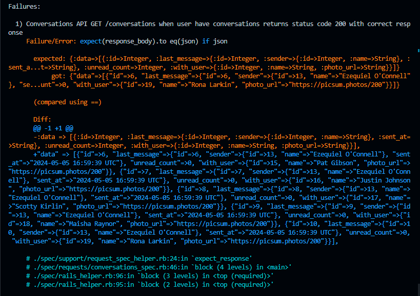

# README

The challenge is make sure when you run `bundle exec rspec`, all result is green (without error):) 

## Version
* Rails v6.1.7
* Ruby v3.3.0
* Database postgreSQL
* Bundle v2.5.9

Test Case Result

I still didn't past all the test (3 pending cause its the model specc)

Mostly my problem in here to understanding the parse with the response, cause when I test in POSTMAN the response is like I want, but the test case show different expected response like this one

Thanks for the opportunity, very glad to learn new experince about using Ruby on rails